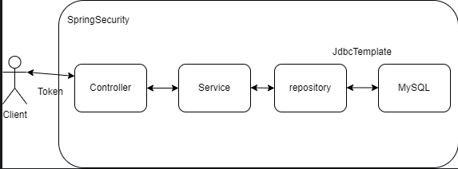

## 소비내역 관리 프로젝트

## 사용 언어 
- Java 8
- SpringBoot 2.x
- SpringSecurity
- JWT
- mysql 5.7

## 요구사항
-[x] 고객은 이메일과 비밀번호 입력을 통해서 회원 가입을 할 수 있습니다.  
-[ ] 고객은 회원 가입이후, 로그인과 로그아웃을 할 수 있습니다. -> 로그아웃 기능 구현 x  
-[x] 고객은 로그인 이후 가계부 관련 아래의 행동을 할 수 있습니다.  
    -[x] 가계부에 오늘 사용한 돈의 금액과 관련된 메모를 남길 수 있습니다.  
    -[x] 가계부에서 수정을 원하는 내역은 금액과 메모를 수정 할 수 있습니다.  
    -[x] 가계부에서 삭제를 원하는 내역은 삭제 할 수 있습니다.  
    -[x] 삭제한 내역은 언제든지 다시 복구 할 수 있어야 한다.  
    -[x] 가계부에서 이제까지 기록한 가계부 리스트를 볼 수 있습니다.  
    -[x] 가계부에서 상세한 세부 내역을 볼 수 있습니다.  
-[x] 로그인하지 않은 고객은 가계부 내역에 대한 접근 제한 처리가 되어야 합니다.  

## Architecture

